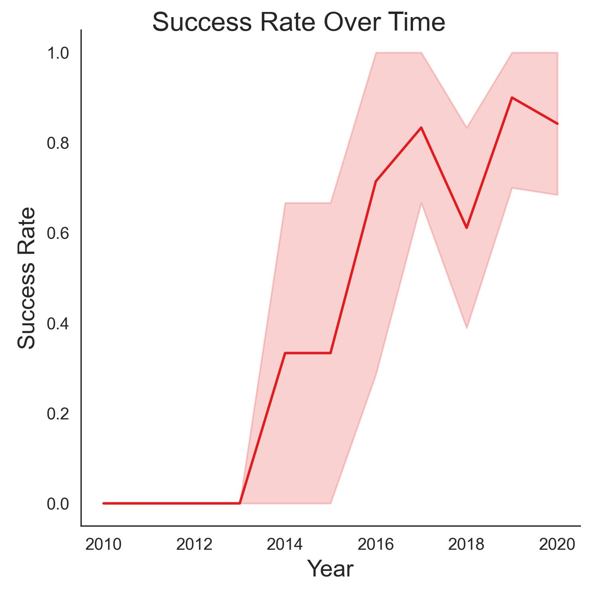
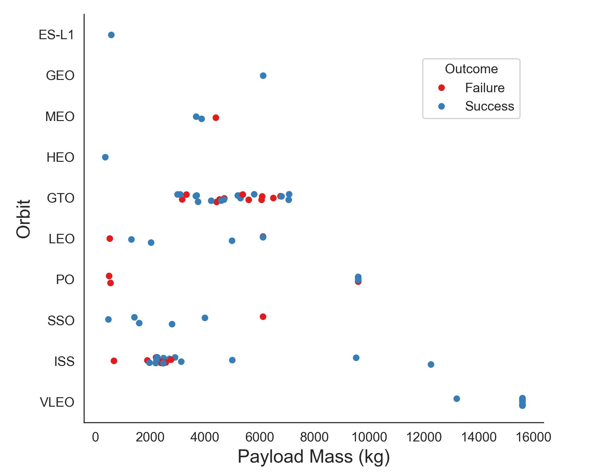
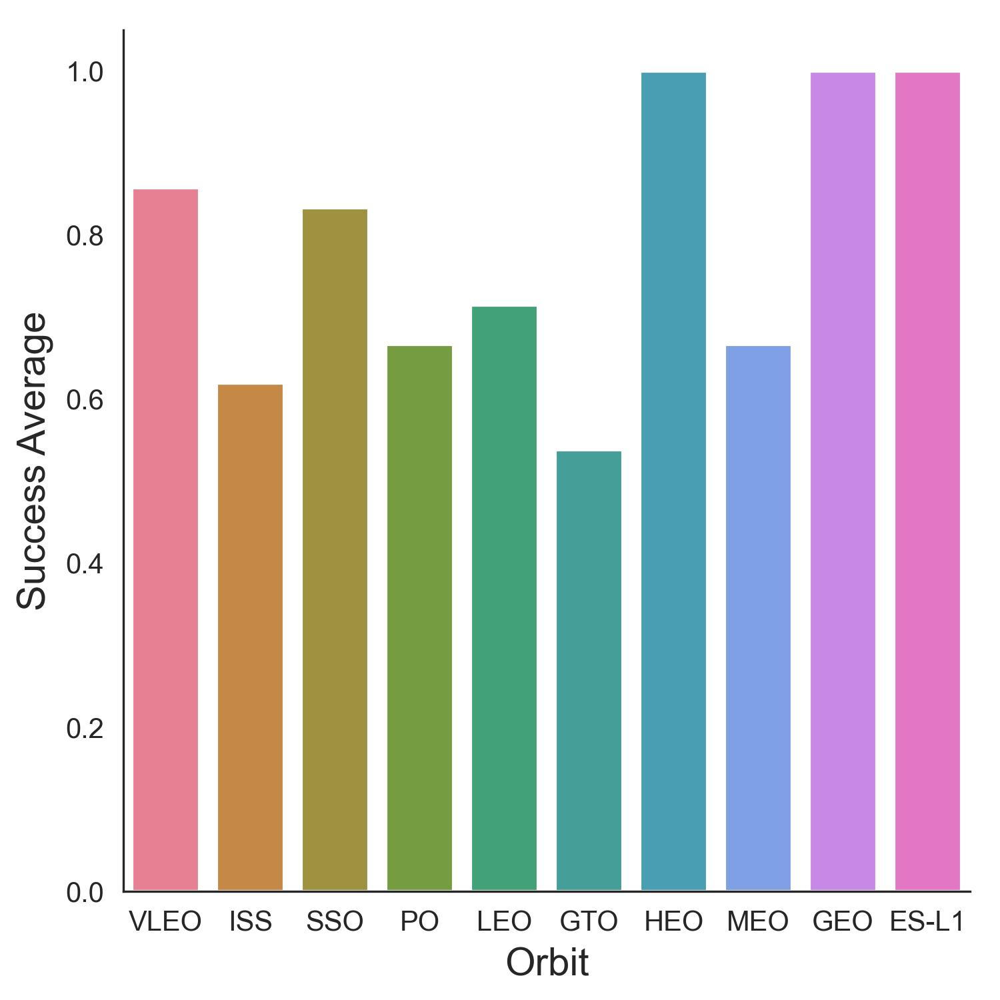

# SpaceX Data Visualisation Report  

## Overview  
This report presents key visual insights derived from the **SpaceX Falcon 9 launch data analysis**. It serves as a complement to the **[main project analysis](./README.md)** by focusing on graphical trends and interactive data representations.  

## Success Rate Over Time  
Falcon 9 first-stage landing success rates have shown **steady improvement** over time, particularly after 2014, when booster reuse technology was refined.  

  

- **Key Observation**: Landing success surpassed **80% by 2020**, indicating significant advancements in reusable rocket technology.  

## Influence of Payload Mass on Landing Success  
An analysis of payload mass revealed no direct correlation with landing success, though **earlier missions exhibited a higher failure rate**.  

  

- **Before Flight 35**, failures were more frequent.  
- **Beyond this point**, landing success stabilised despite variations in payload mass.  

### Payload Distribution by Orbit Type  
Different orbit types influence payload mass constraints and landing probabilities.  

  

- **Geostationary Transfer Orbit (GTO)**: Payloads ranged between **3 and 8 tons**, reflecting the high energy demands for placement in geostationary orbit.  
- **International Space Station (ISS) Orbit**: Concentrated around **2.5 tons**, aligning with ISS resupply missions.  
- **Very Low Earth Orbit (VLEO)**: Hosted **the heaviest payloads**, with **most missions achieving successful landings**.  

## Geospatial Analysis: Launch Sites & Landing Success  
Launch performance varied across different **SpaceX launch sites**, affecting landing success rates.  

### Kennedy Space Center (KSC)  
  
- A **high success rate** was observed at this site, with most failed landings occurring during the early years.  

### Cape Canaveral Space Force Station (CCSFS)  
  
- **Landing success improved significantly** over time, with **early failures concentrated in 2015–2016**.  

### Payload Distribution by Launch Site  
The following figure illustrates how payload masses were distributed across different launch sites.  

  

- **CCSFS SLC-40**: Primarily used for **payloads below 10 tons and some above 14 tons**.  
- **KSC LC-39A**: Supported a **broader payload range (2–16 tons)**, indicating greater operational flexibility.  
- **Vandenberg Air Force Base (VAFB)**: Used mostly for missions with **payloads around 10 tons**.  

## Orbit-Based Landing Success Rates  
An analysis of orbit types and their respective landing success rates revealed key patterns.  

  

  

- **GTO missions experienced moderate landing success**, likely due to the higher energy demands for such missions.  
- **VLEO missions recorded the highest success rates**, reinforcing the reliability of booster recovery for lower-altitude orbits.  

## Machine Learning Predictions  
A machine learning model was developed to classify **booster landing success** based on historical launch data.  

### Model Performance Comparison  
- **Logistic Regression** achieved the highest **in-sample accuracy (94.4%)**.  
- **Decision Tree** exhibited the **smallest discrepancy between training and test performance**, suggesting better generalisation.  
- **Overall test accuracy** remained at **83.3% across all models**, indicating consistent performance.  

## Interactive Dashboard  
A **Tableau dashboard** was developed to allow dynamic filtering of **launch success probabilities, booster recovery trends, and orbit-based performance metrics**.  

🔗 [Interact with the Dashboard on Tableau Public](https://public.tableau.com/views/SpaceX_17407674922060/Dashboard1?:language=en-GB)  

**Dashboard Preview**
  

## Conclusion  
This report presents **key visual trends and insights** from the **SpaceX Falcon 9 launch dataset**, highlighting:  
- **The impact of payload mass, orbit type, and launch site on landing success**.  
- **The evolution of Falcon 9’s first-stage recovery technology**.  
- **Data-driven insights supporting cost estimation and mission planning in commercial spaceflight**.  

For a more in-depth exploration, the **interactive dashboard** provides additional tools for data analysis.  

---
